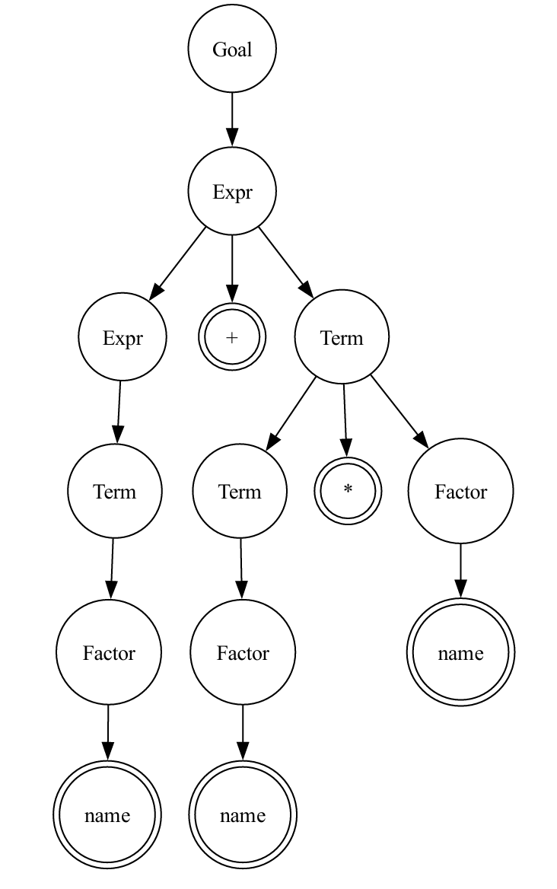

## 项目概述

这是一个编译器前端实现项目，主要包含了有限自动机(FA)、词法分析器(Lexer)和语法分析器(Grammar)三个核心模块。项目实现了从正则表达式到最小化DFA的转换、词法分析以及LL(1)和LR(1)语法分析等功能。

该项目分为两个主要部分：Python算法实现和Web端交互可视化。Python部分主要实现了有限自动机、词法分析器和语法分析器等核心算法功能，便于理解和学习源代码，而Web端则使用JavaScript提供了可视化界面，方便用户交互和展示分析结果。

------
## Python部分

### 项目结构

```
├── FA.py          # 有限自动机转换算法实现
├── Lexer.py       # 词法分析器实现
├── Grammar.py     # 语法分析器实现
├── input/         # 输入文件目录
├── output/        # 输出文件目录
```

### 部署

安装Python依赖
```bash
pip install -r requirements.txt
```


### 语法分析示例
```python
# 使用DFA和配置构造词法分析器
dfa = DFA.load("./input/Lexer/Expr_DFA.txt")
with open("./input/Lexer/Expr_CharCat.json", "r", encoding="utf-8") as f:
    config = json.load(f)
lexer = Lexer(dfa, config)

# 分析输入字符串
lexer.analyze("a + b * c")
print(lexer.get_token().tokens)

# 分析结果
[('name', 'a'), ('+', '+'), ('name', 'b'), ('*', '*'), ('name', 'c')]
```

### 语法分析示例

```python
# 加载语法规则
grammar = Grammar.load("./input/Grammar/Expr_G.txt")

# LL(1)分析
print("First集合:", grammar.firstSet())
print("Follow集合:", grammar.followSet())
print("Select集合:", grammar.selectSet())
print("LL(1)分析表:", grammar.LL1_table())

# 进行语法分析
tokens = Token([('name', 'a'), ('+', '+'), ('name', 'b'), ('*', '*'), ('name', 'c')])
dot, processList, syntaxMsg = grammar.LL1_analyze(tokens)
```

**分析结果**



------
## JavaScrip部分

### 项目结构

```
├── public/        # Web界面文件
├── utils/         # JavaScript实现词法分析和语法分析
└── server.js      # Web服务器
```

### 部署

1. 安装Node.js依赖
```bash
npm install
```

2. 启动Web服务器
```bash
npm run start
```

3. 访问Web界面
项目提供了基于Web的可视化界面，可以直观地展示：
   - 有限自动机的状态转换图
   - 词法分析过程和结果
   - 语法分析树
- 词法分析：FA转换算法 - http://localhost:8086/FA.html
- 词法分析器 - http://localhost:8086/Lexer.html
- LL(1)语法分析 - http://localhost:8086/LL1.html
- LR(1)语法分析 - http://localhost:8086/LR1.html


## 许可证

MIT License